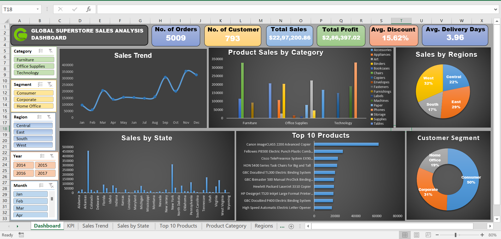

# 📊 Global Superstore Sales Dashboard (Excel)

An **interactive Excel dashboard** analyzing sales performance of the [Global Superstore dataset](https://www.kaggle.com/datasets/vivek468/superstore-dataset-final).  
This project provides insights into **sales trends, product performance, regional growth, and customer segmentation** — helping decision-makers identify opportunities and optimize strategies.

---

## 📸 Dashboard Preview

---

## 🚀 Key Features

- **KPI Cards**:
  - 📦 Orders
  - 👥 Customers
  - 💰 Sales
  - 📈 Profit
  - 🎯 Discount %
  - 🚚 Avg. Delivery Days

- **Charts & Visuals**:
  - 📅 Sales Trend (Month/Year)
  - 📊 Category & Sub-category Performance
  - 🗺️ Sales by State & Region
  - 🏆 Top 10 Products
  - 👥 Customer Segment Share

- **Interactive Filters**:
  - Year | Month | Region | Category | Segment

---

## 🛠 Tools & Techniques

- Microsoft Excel 2016:
  - Pivot Tables & Charts
  - Slicers & Timeline Filters
  - KPI Cards
  - Custom Chart Formatting

---

## 📂 Files in this Repository

- [`Superstore_rawdata.csv`](Superstore_rawdata.csv) – Original dataset
- [`Superstore_Dashboard.xlsx`](Superstore_Dashboard.xlsx) – Final Excel dashboard
- [`Dashboard_Screenshot.png`](Dashboard_Screenshot.png) – Dashboard preview
- [`README.md`](README.md) – Documentation

---

## 📊 Dataset

- **Source**: [Kaggle - Superstore Dataset](https://www.kaggle.com/datasets/vivek468/superstore-dataset-final)  
- **License**: Public dataset — free for analysis and learning purposes.

---

## 📥 How to Use

1. Download the `Superstore_Dashboard.xlsx` file.
2. Open in Excel 2016 or later.
3. Use slicers to filter by **Year, Month, Region, Category, or Segment**.
4. View KPI changes and charts update instantly.

---

## 📧 Contact

🔗 [LinkedIn – Harsh Belekar](https://www.linkedin.com/in/harshbelekar)
